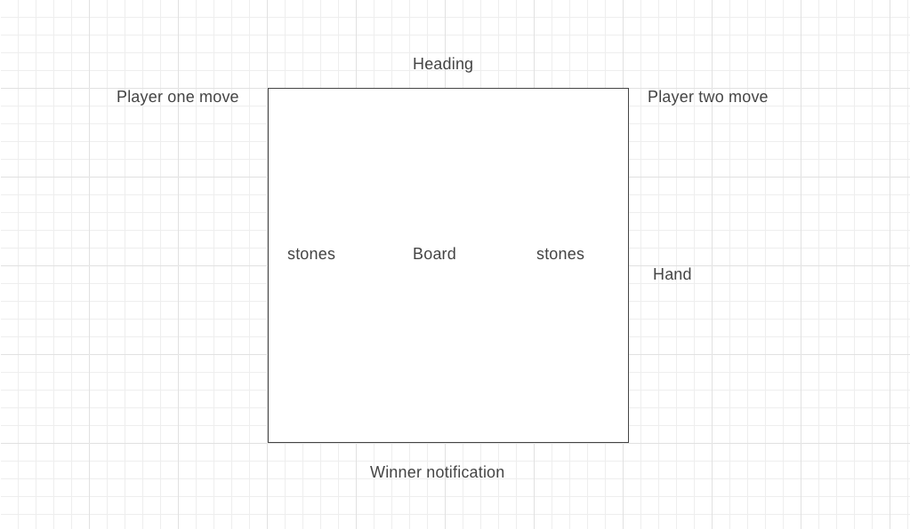

# Background and Overview
This app is a game which mixes coding and my culture. Alkkagi is a traditional korean game which is played with two sets of stones and a Go board. A player wins when they flick off all the stones of the opponent player. This project runs completely on Javascript OOP and Canvas.

# MVP List
* Users should be able to choose between single player and multiplayer
* The board gets rendered with the starting stones
* The user is able to shoot the stones
* The stone will be able to be shot at an intensity indicated by the user
* The stone can get shot off the board and can shoot another stone off the stone
* Game is won or lost depending on if a user has all their stones shot off the board

# Technologies, Libraries, APIs
* A pool game library https://github.com/henshmi/Classic-Pool-Game
* Canvas?

# Wireframes

# Implementation Timeline
* 1/6 - Rendering the board and setting up display
* 1/7 - Setting up player, board, stones and hand
* 1/8 - Physics of the game
* 1/9 - User interface, clicking, powerlevels
* 1/10 - Get the game to blend together and styling
